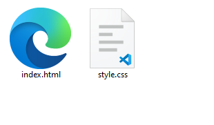

## 1. Quels logiciels à installer sur mon ordinateur pour coder en html (et autres) ?

Je vous conseille d'installer [Visual studio code](https://code.visualstudio.com/Download), il est gratuit et voilà un mini-tutoriel de raccourcis clavier avec les commandes qui me paraissent être les plus importantes: [cliquez-ici](./VSCode_tips.md).  

Bonnes pratiques et installation de VSCode : [cliquez-ici](./VSCode_bonnes_pratiques.md).

## 2. Comment voir ma page html ?

Normalement vous devriez avoir vos deux pages dans votre dossier.  
  

Double-cliquez tout simplement sur `index.html` et voilà ! Vous verrez votre page html.  
**Attention : cela ne veux pas dire que cette page est visible depuis internet.**

## 3. et si je veux une deuxième page ?

Comme vous avez appris dans les [bonnes pratiques](./VSCode_bonnes_pratiques.md), vous pouvez créer un second fichier `html`, nommons-le par exemple : `seconde.html`.  

Maintenant vous pouvez faire un lien vers cette page avec la balise `<a>` comme ceci :  
```html
<a href="./seconde.html">Seconde page</a>
```
Ajoutez ensuite les attributs dont vous avez besoin (ex: `target:'_blank'`).  

Pour revenir à la première page vous pouvez faire un lien depuis la deuxième, vers la première !  
```html
<a href="./index.html">Seconde page</a>
```

## 4. J'ai pas vraiment compris le système des liens.. Pourquoi il y a un "./" devant mes noms de fichier dans les liens ?

C'est une question un poil complexe. Mais c'est **logique**. Faut juste comprendre.  
Quand je fais un lien vers un fichier il me faut *sélectionner* le ***dossier courant***.  
Je m'explique :
```bash
# Mon projet
    ├── index.html # fichier contenant le code html
    ├── seconde.html # ma deuxieme page html
    └── style.css  # fichier contenant le code css
```
Dans mon lien `<a>` j'écris `./` pour dire au *sélécteur* : **"cherche dans le même dossier que `index.html`"**
Et dans ce dossier il y a un fichier nommé `seconde.html`.  
Mon lien sera donc `./seconde.html`.

### Un autre exemple ?

Imaginons maintenant que j'ai cette structure de fichiers.  
```bash
# Mon projet
    ├── index.html        # fichier contenant le code html
    ├── seconde.html      # ma deuxieme page html
    └── quelconque/       # un dossier quelconque
    │  ├── troisieme.html # ma troisieme page html
    └── style.css         # fichier contenant le code css
```

Si je veux faire un lien **depuis** `index.html` **vers** `troisieme.html`, je dois écrire :  
`./quelconque/troisieme.html`  

Ce qui veut dire :
* `./` dans le dossier courant
* `quelconque/` j'ai un dossier nommé `quelconque`
* qui contient un fichier nommé `troisieme.html`

```
Super ! Mais .. et l'inverse ?
```

OK MAINTENANT L'INVERSE :  
Vous aurez remarqué, le fichier `troisieme.html` est dans un dossier "plus bas" que `index.html`.  
Comment faire ?  
=> pour accéder au dossier juste au dessus il faut écrire "`../`"  
Vous voyez le schéma ?
* `./` signifie : le dossier **courant**
* `../` signifie : le dossier parent
* donc `../../` signifie : le dossier grand-parent
* etc.

## DONC
Dans mon lien **depuis** `troisieme.html` **vers** `index.html` j'aurais le lien suivant :  
`../index.html`  

# Et pour les images ?

Eh bien pour les images, reprenons la manière de ranger mes fichiers plus haut.  
Je vous propose de faire comme suit :  
```bash
# Mon projet
    ├── index.html        # fichier contenant le code html
    ├── seconde.html      # ma deuxieme page html
    └── quelconque/       # un dossier quelconque
    │  ├── troisieme.html # ma troisieme page html
    ├── ressources/       # mon dossier d'images/ressources
    │  ├── poisson.png    # une image de poisson
    │  ├── mer.jpg        # une autre de la mer
        .
        .
        .
    └── style.css         # fichier contenant le code css
```

Vous voyez ? J'ai un dossier de ressources où je mets toutes mes images, vidéos, médias, etc.  

Si je veux afficher l'image `poisson.png` **dans** `index.html`, je dois écrire le code suivant:  
```html

```
le `src` veut dire :
* `./` dans le dossier **courant**
* `ressources/` j'ai un dossier `ressources`
* `poisson.png` dans lequel il y a mon image !

Capish ?