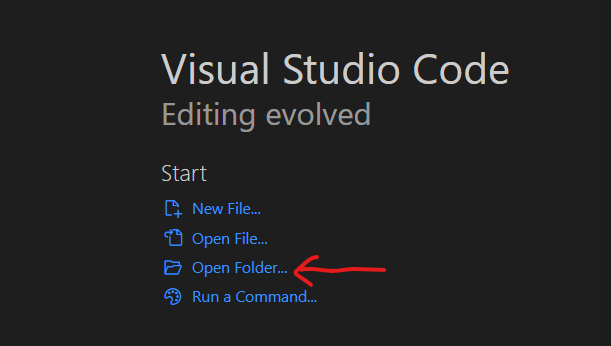
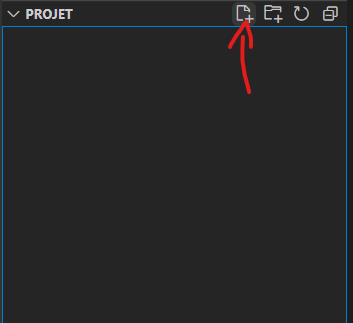
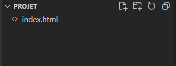
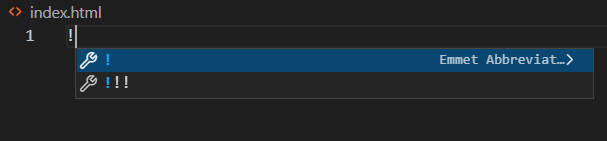
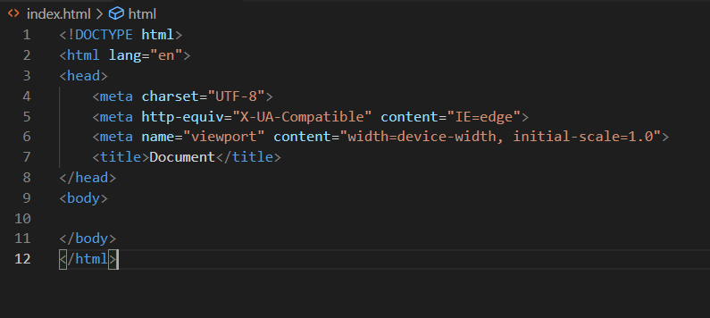

# Bonnes pratiques VSCode

* Pour commencer, créer un nouveau dossier sur votre ordinateur. Disons, sur le bureau et nommez-le, par exemple, "projet".
* Lorsque vous ouvrez VSCode choisissez d'ouvrir ce dossier 
* Maintenant créer un fichier dans ce dossier 
* Nommez-le `index.html` 
* Vous verrez qu'il y a deux petits chevrons `<>` à côté du nom. Cela veut dire que VSCode reconnait bien ce fichier comme un fichier html
* A l'intérieur de ce fichier, pour démarrer je vous propose le raccourcis suivant : appuyez une fois sur `!` et enfin appuyez sur `entrer` 
* Cela va automatiquement créer le début d'une page, vous pourrez reconnaître les différentes sections `<head>` avec notamment sa balise `<title>` et `<body>` qui est vide 
* Vous pouvez aussi créer votre fichier `style.css` avec la même méthode et rajouter la ligne suivante dans votre `<head>` : `<link rel="stylesheet" type="text/css" href="style.css">`

Vous êtes fin prêt à démarrer !