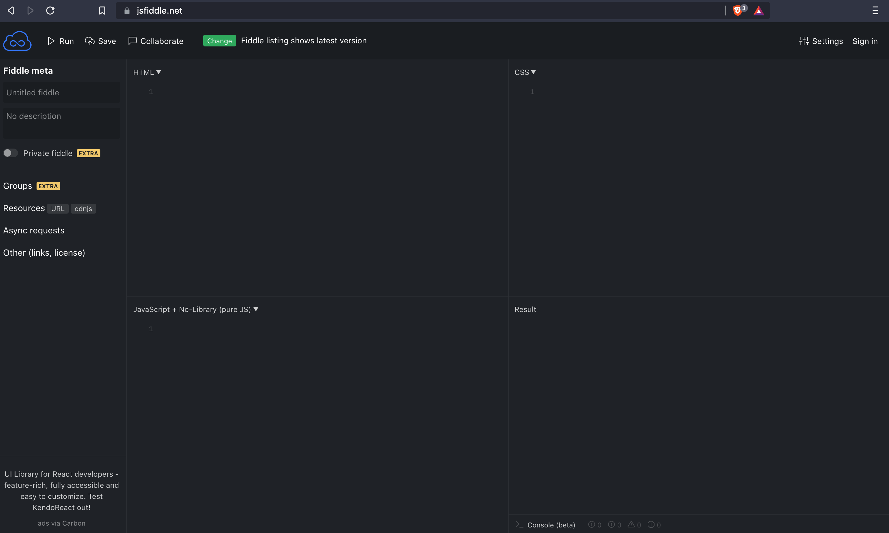
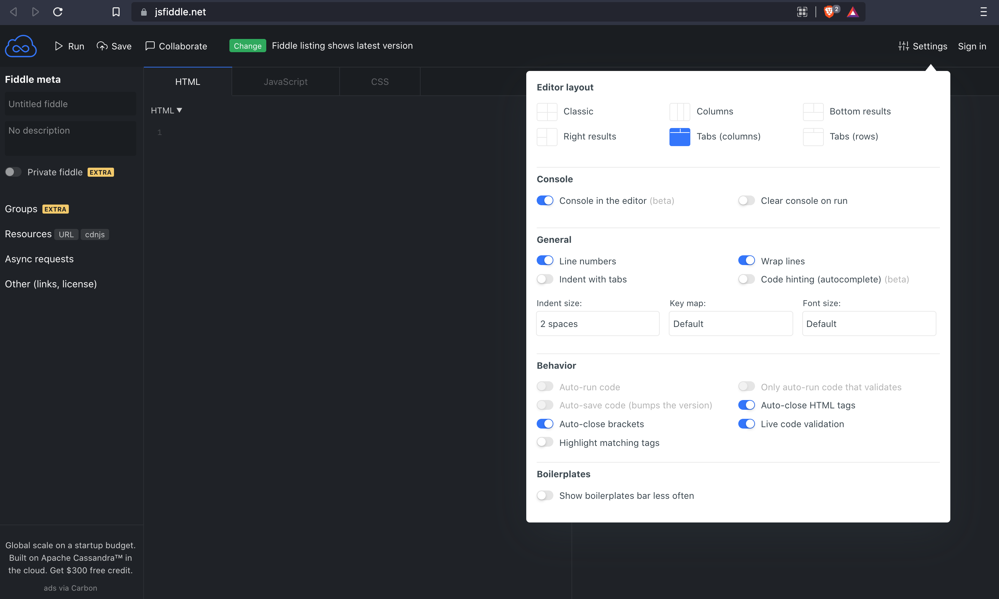

# Tutoriel pour JSFiddle

JSFiddle est un éditeur de code en ligne pour tester et présenter des extraits de code HTML, CSS, JS ... Il est composé de trois volets dans lesquels vous pouvez saisir différents types de code, notamment **HTML**, **CSS** et **JavaScript**. Vous voyez les résultats de ce que vous tapez dans ces boîtes dans le volet **Résultat**.





- La barre d'outils supérieure comporte des boutons pour **exécuter** et **enregistrer** votre code.

Vous pouvez redimensionner n'importe lequel des volets de JSFiddle en cliquant et en faisant glisser la bordure qui les sépare.

Vous êtes surtout concerné par le volet **HTML** et **CSS**.


## Configuration espace de travail

Dans cette partie nous allons configurer l'interface de JSFiddle pour le rendre fonctionnel pour vous.

Dans un soucis de lisibilité et de confort, nous vous conseillons cet affichage :



## Premier Programme

1. Créez un dossier sur votre ordinateur avec le nom du chapitre ou du projet pour stocker votre code en local.  
   **Cette étape est importante car vous vous devez de sauvegarder souvent votre code sur votre ordinateur pour éviter toutes pertes.**

```
# Format
└── 01-html-structure/    # premier dossier
│       ├── ... 
│       ├── index.html  # code html
│       └── style.css   # code css
│              
└── 02-html-standard/    # second dossier
│       ├── ...
│       └── projet-lumières/ # dossier contenant le projet de fin de partie à réaliser     
│             ├── index.html
│             └── style.css
└── 15-projet-final/    # dossier contenant le projet final à rendre 
        ├── ... 
        ├── index.html
        └── style.css
```

2. **A titre d'exemple** : Copiez-collez le code HTML suivant  dans l'onglet HTML de l'éditeur :

```html
<!DOCTYPE html>
<html lang="en">
<head>
    <meta charset="UTF-8">
    <meta http-equiv="X-UA-Compatible" content="IE=edge">
    <meta name="viewport" content="width=device-width, initial-scale=1.0">
    <title>Document</title>
</head>
<body>
    <h1>Je suis un titre</h1>
    <button class="favorite styled"
        type="button">
    Useless button
    </button>

</body>
<style>
.styled {
    border: 0;
    line-height: 2.5;
    padding: 0 20px;
    font-size: 1rem;
    text-align: center;
    color: #fff;
    text-shadow: 1px 1px 1px #000;
    border-radius: 10px;
    background-color: rgba(220, 0, 0, 1);
    background-image: linear-gradient(to top left,
                                      rgba(0, 0, 0, .2),
                                      rgba(0, 0, 0, .2) 30%,
                                      rgba(0, 0, 0, 0));
    box-shadow: inset 2px 2px 3px rgba(255, 255, 255, .6),
                inset -2px -2px 3px rgba(0, 0, 0, .6);
}

.styled:hover {
    background-color: rgba(255, 0, 0, 1);
}

.styled:active {
    box-shadow: inset -2px -2px 3px rgba(255, 255, 255, .6),
                inset 2px 2px 3px rgba(0, 0, 0, .6);
}
</style>
</html>
```

1. Appuyez sur le bouton `Exécutez` ou `Run` pour visualiser le rendu final

___
[Retour au cours](./01-html-structure/1-introduction.md)
